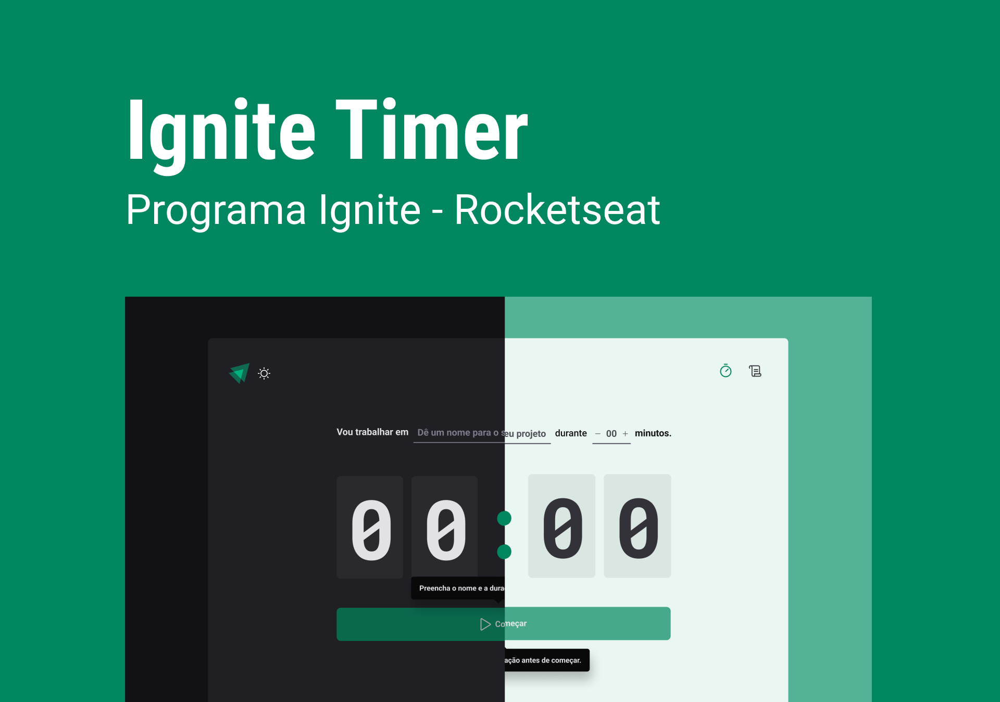
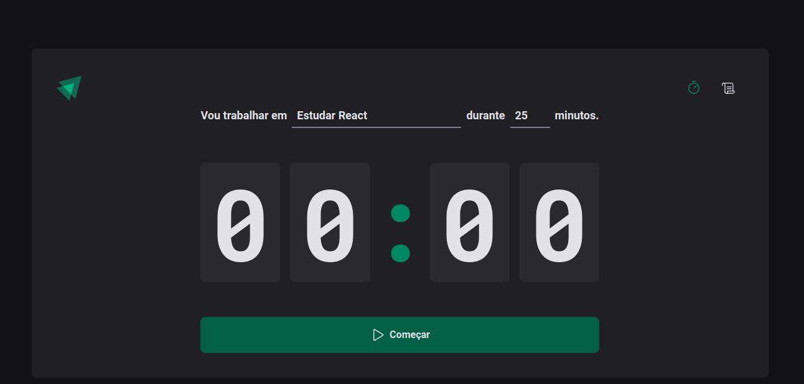
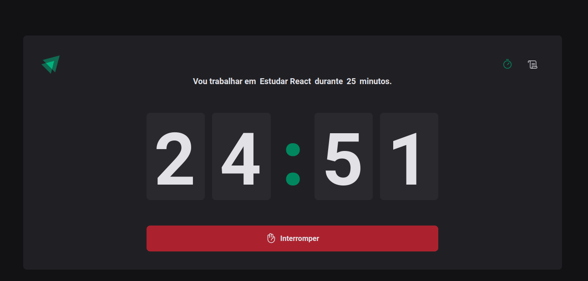
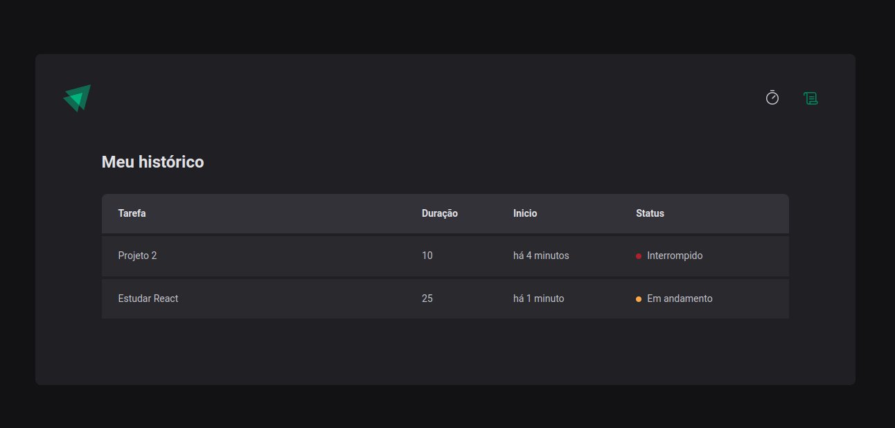

<!-- CABEÇALHO -->

    <h1>
      ⏲️ Ignite Timer ⏲️ 
    </h1>
    

        <a href="#%EF%B8%8F-sobre-o-projeto">Sobre o Projeto</a> •
        <a href="#-funcionalidades">Funcionalidades</a> •
        <a href="#-layout">Layout</a> •
        <a href="#%EF%B8%8F-tecnologias">Tecnologias</a> •
        <a href="#-autor">Autor</a>
    

<!-- SOBRE O PROJETO -->

## 🖥️ Sobre o Projeto

        

 

> Projeto desenvolvido durante módulo Criando SPAs com ReactJS da Formação de React.js da Rocketseat.

Esse projeto consiste em uma aplicação de cronômetro no estilo **[Pomodoro](https://pt.wikipedia.org/wiki/T%C3%A9cnica_pomodoro)** para gerenciamento de tarefas e aumento de produtividade.

<!-- FUNCIONALIDADES -->

## 💡 Funcionalidades

- [x] Criar novo ciclo de tarefa
- [x] Acompanhar o tempo de cada tarefa
- [x] Interromper o ciclo de uma tarefa
- [x] Ver o histórico de ciclos

<!-- LAYOUT -->

## 🎨 Layout

> A aplicação tem como base o seguinte layout no [Figma](https://www.figma.com/community/file/1127351821076435124)

  
  
  

<!-- TECNOLOGIAS -->

## 🛠️ Tecnologias

Para o desenvolvimento desse projeto, as seguintes ferramentas foram utilizadas:

- **[Vite](https://vitejs.dev/)**
- **[React.js](https://pt-br.reactjs.org/)**
- **[TypeScript](https://www.typescriptlang.org/)**
- **[Styled Components](https://www.styled-components.com/)**
- **[React Hook Form](https://react-hook-form.com/)**
- **[React Router DOM](https://github.com/remix-run/react-router)**
- **[Zod](https://zod.dev/)**
- **[Context API](https://react.dev/learn/passing-data-deeply-with-context)**
- **[Immer](https://github.com/immerjs/immer)**

## 👨‍💻 Autor

Marcos Kenji Kuribayashi

 

---

Desenvolvido por Marcos Kenji Kuribayashi 😉
